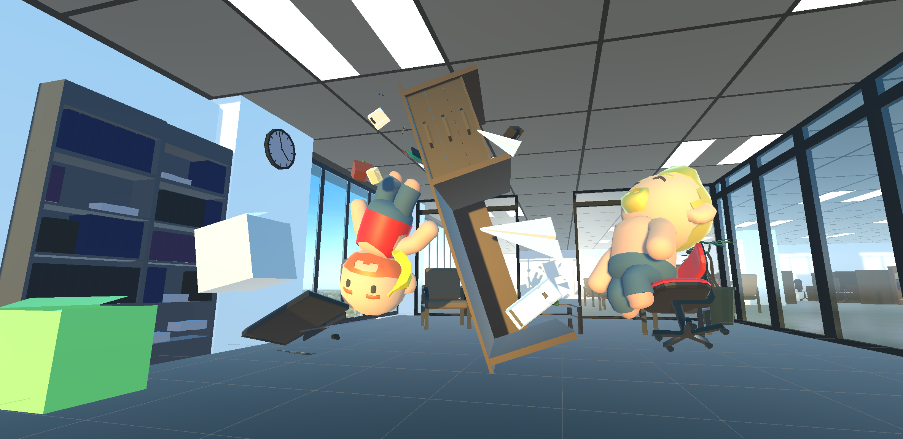
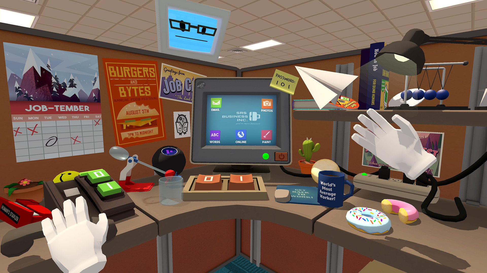
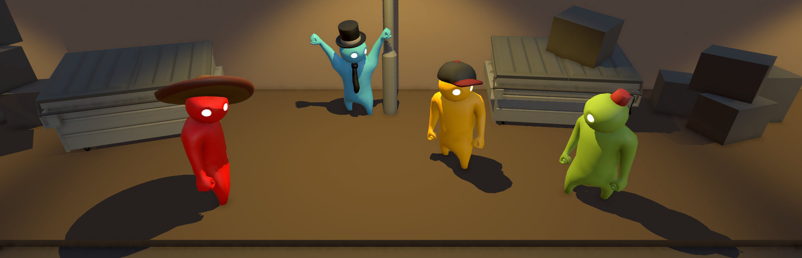

# БЕЗУМНЫЙ ОФИСНЫЙ НИНДЗЯ (базовый прототип)

Взяв на себя роль безумного офисного ниндзи, мы должны уничтожить зомби-клерков как можно быстрее.

Экшен от первого лица в стилистике low-poly офиса
- Windows
- Альбомная ориентация

## [Ссылка на GDD](https://docs.google.com/document/d/1mCT-PGhrWkMRz-oXIaymxF4BTHceJZtvJRr8SLicTLg/edit?usp=sharing)

### Концепция
Зачищаем офис от всех клерков с помощью подручных средств на время.
### Визуальный стиль
Low-poly. Основыными референсами служат Job Simulator и Gang Beasts.

### Жизненный цикл
1. Появились в начале уровня.
2. Собрали стартовый набор ресурсов.
3. Зачистили как можно быстрее уровень от клерков-зомби.
4. Возвращаемся к пункту 1.
### Механики и фичи
#### Core механики
Передвижение на стуле
- Контроль камеры и передвижения от первого лица
Противники (искусственный интеллект)
- Патрулирование офиса, при отсутствии игрока в поле видимости
- Преследование замеченного игрока
- Атака игрока при достаточно малой дистанции
Метание бумажных самолетиков (физика полета)
- Сила сопротивления воздуха
- Подъемная сила
- Стабилизирующие горизонтальные и вертикальные моменты
Сбор материала для изготовления бумажных самолетиков
- Возможность подбирать бумажные предметы на уровне (листы, пачки бумаги, мусор)
#### Additional механики
Продвинутое передвижение на стуле
- Возможность делать рывки
- Управление импульсом после рывка одновременно с отзывчивостью базового управления
- Подсветка подбираемых предметов
Active ragdoll физика противников
- Для большей комичности противники двигаются как тюфяки
#### Juice механики
Интерактивность бумажного самолетика
- Выгибающиеся крылья самолетика в зависимости от величины подъемной силы
- Сминаемость при столкновении с препятствием с учетом силы столкновения
Интерактивность стула
- Поворачивающиеся в сторону движения колесики
Кидающиеся противники
- Возможность забавно раскидывать предметы, мешающие передвижению

## Билд
[Билд под Win](https://drive.google.com/file/d/1aO4oFevPniOwxVVo4xqQ_Gdx0qFCNdvd/view?usp=drive_link)

## Инструкция по запуску
Не требуется.
